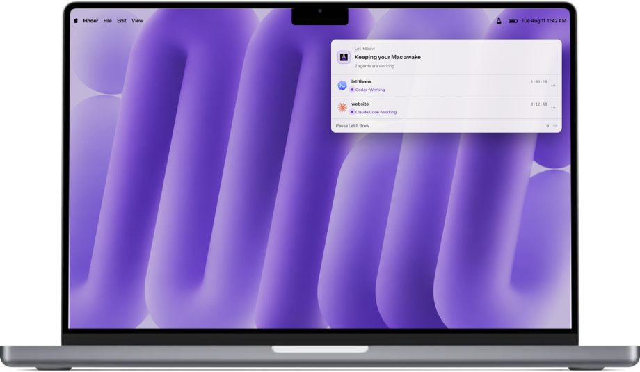

  

I’m a senior software engineer in applied AI. I like turning “surely there’s a
better way” into something real.

## Currently building

<table>
  <tr>
    <td width="38%" valign="top">
      <h3>
        <a href="https://github.com/ruban-24/letitbrew">
          
          Let It Brew
        </a>
      </h3>
      
macOS · Swift

      
I founded Let It Brew, a macOS app that keeps your Mac awake while coding agents work, then lets it sleep when they stop.

      

        <a href="https://letitbrew.app">Website</a> ·
        <a href="https://github.com/ruban-24/letitbrew/releases/latest/download/LetItBrew.dmg">Download</a> ·
        <a href="https://github.com/ruban-24/letitbrew">Source</a>
      

    </td>
    <td width="62%" align="center" valign="middle">
      
    </td>
  </tr>
</table>

## Other work

- [agex](https://github.com/ruban-24/agex) — Run AI agents in parallel, each on
  its own Git branch and worktree.

## Support my work

If something I’ve built has been useful, you can support whatever I make next.

  
  &nbsp;
  

## Elsewhere

[LinkedIn](https://www.linkedin.com/in/ruban-bhatia-697295159/) ·
[X](https://x.com/RubanBhatia) ·
[Reddit](https://www.reddit.com/user/rubanbhatia/)

Animation by <a href="https://lottiefiles.com/free-animation/work-from-home-IqixnLv3gW">Vigneshwaran R</a> via LottieFiles, used under the <a href="https://lottiefiles.com/page/license">Lottie Simple License</a>.
